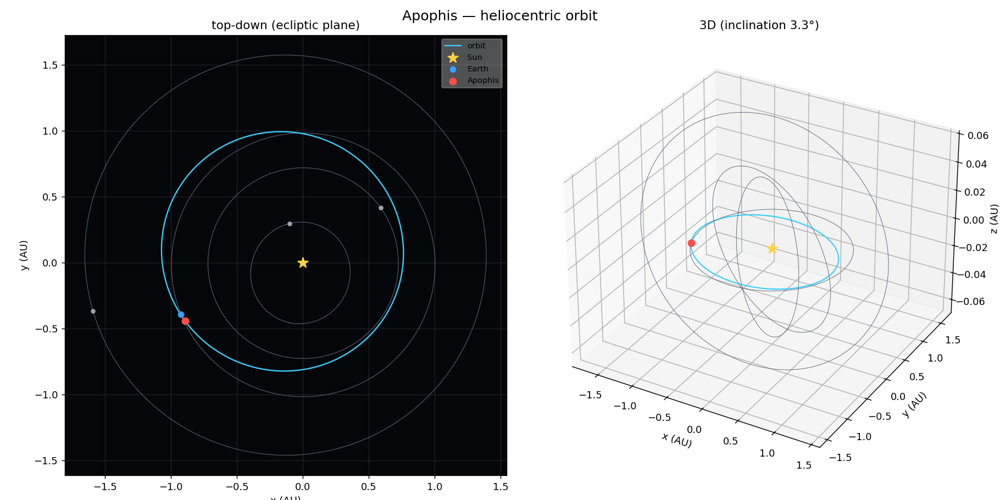

# 🛰️ asteroid

**Load an asteroid from a database and compute its trajectory — in one line.**

```bash
asteroid Apophis --date 2029-04-13
```



> A from-scratch orbital-mechanics engine: real NASA/MPC data in, Kepler's
> equation and two-body + N-body propagation by hand, positions · sky coordinates
> · close approaches · orbit determination · impact-risk watchlist · out.

`asteroid-trajectory` is a small, dependency-light orbital-mechanics engine and
CLI. It loads real Keplerian orbital elements (from a bundled database of famous
asteroids, or live from NASA's Small-Body Database), propagates them with a
**from-scratch two-body solver**, and tells you where the body is, where it is in
your sky, how bright it is, and when it next passes close to Earth — then draws
the orbit. It can even go the other way and **determine an orbit from scratch** —
including pulling **freshly discovered objects off the MPC NEO Confirmation Page**
that nobody has computed yet and solving a preliminary orbit from their raw
observations — and it pulls **NASA's live impact-risk watchlist** so you can
compute any of the asteroids planetary-defense researchers are actually tracking.
It's built to be genuinely useful *and* to be a clear, readable illustration of
the physics.

---

## Quickstart

```bash
cd asetroid-trajectory
python3 -m venv .venv
.venv/bin/pip install -e ".[viz]"        # core + matplotlib/plotly visualizations

# make `asteroid` a bare command (symlink the console script onto your PATH):
ln -sf "$(pwd)/.venv/bin/asteroid" ~/.local/bin/asteroid

# now just type:
asteroid Apophis --date 2029-04-13
```

(`~/.local/bin` is on most PATHs; otherwise use any PATH directory. You can also
run `.venv/bin/asteroid …` directly, or the bundled `./asteroid-cli` launcher.)

Core dependencies are just **numpy**, **requests**, and **rich**. The `[viz]`
extra adds **matplotlib** and **plotly** for PNG / interactive-HTML orbit plots.

---

## What it can do

```bash
asteroid Apophis                          # state right now
asteroid Apophis --date 2029-04-13        # state on a date (the famous flyby)
asteroid --name Ceres --date 2026-06-29   # explicit flag form
asteroid Ceres --span 90d --step 5d       # ephemeris table over a span
asteroid Apophis --approaches 2025..2035  # find & rank Earth close approaches
asteroid Apophis --date 2027-06-09 --validate   # check our math vs NASA Horizons
asteroid Apophis --date 2027-06-09 --precise    # N-body propagation (Sun + 8 planets)
asteroid Apophis --determine              # derive the orbit from MPC observations online
asteroid --neocp                          # freshly discovered objects with NO orbit yet
asteroid P22nJzF --determine              # solve one of those open problems from raw data
asteroid --risk-list                      # NASA's live asteroid impact-risk watchlist
asteroid "2000 SG344" --risk              # one object's NASA Sentry impact assessment
asteroid Apophis --animate                # animate the asteroid tracing its orbit
asteroid Apophis --ascii                  # ASCII orbit map in the terminal
asteroid Apophis --plot   [FILE]          # matplotlib PNG (2D + 3D)
asteroid Apophis --html   [FILE]          # interactive, rotatable 3D Plotly
asteroid Bennu   --json                   # machine-readable output
asteroid --list                           # list the local database
asteroid --info Psyche                    # full parameter sheet
asteroid --update [NAMES...]              # refresh / add bodies from JPL
asteroid --observations sights.txt --as "2027 XK"   # determine an orbit from scratch
```

The positional name and `--name` are interchangeable. Dates accept
`YYYY-MM-DD[ HH:MM]`, `now`, or a raw Julian Date (`JD2461200.5`). If a body
isn't in the local cache, it's fetched live from JPL and cached (use `--offline`
to forbid the network).

### Example report

```
99942 Apophis (2004 MN4)   [Aten · NEO · PHA]
        Orbital elements  (epoch 2026-06-09 · JD 2461200.5)
 a (semi-major)  0.922359 AU  e (eccentricity)  0.191149
i (inclination)  3.3410°         Ω (asc. node)  203.8937°
  ω (arg. peri)  126.6796°       M (mean anom)  175.3304°
   perihelion q  0.7461 AU              period  323.56 d (0.886 yr)
     aphelion Q  1.0987 AU         mean motion  1.11264°/d
╭─ State at 2029-04-13 00:00:00 UTC ───────────────────────────────────────────╮
│ Sun distance         1.00590 AU (   150,480,382 km)                          │
│ Earth distance Δ     0.00355 AU (       530,446 km)  [1.38 lunar dist]       │
│ Heliocentric ecl  lon 203.003°  lat  -0.052°                                 │
│ Sky (RA/Dec)      14h 03m 24.9s   -28° 53' 35.4"                             │
│ Solar elongation   158.08°      phase angle  21.85°                          │
│ Heliocentric speed  28.320 km/s                                              │
│ Apparent magnitude   7.91  (binoculars)                                      │
╰──────────────────────────────────────────────────────────────────────────────╯
```

---

## Determining an orbit from scratch 🔭

The commands above *propagate* orbits that someone has already computed. But you
can also go the other way — start from raw sky observations and work the orbit
out. This is the inverse problem Gauss invented in 1801 to recover the
newly-lost Ceres (the first body in our database).

**The easy way — pull observations online:**

```bash
asteroid Apophis --determine
```

This fetches the object's real astrometry from the **Minor Planet Center** (no
file, no key), then re-derives the orbit and saves it. With proper topocentric
observatory corrections the fit lands at **sub-arcsecond residuals** and elements
within ~0.1% of JPL:

```
╭─ ✓ Orbit determined: Apophis ──────────────────────────────────╮
│   Observations  29 over a 45-day arc                           │
│   Fit residual  0.283" RMS  (8 iterations · excellent)         │
│   Epoch         2013-03-14 (JD 2456365.7713)                   │
╰────────────────────────────────────────────────────────────────╯
```

You can determine and act on the result in one line, e.g.
`asteroid Apophis --determine --approaches 2027..2031`.

**The manual way — your own observations.** Give it a plain text file — each
line a UTC date, a right ascension, and a declination:

```
# date (UTC)        RA (HH:MM:SS)   Dec (±DD:MM:SS)
2027-03-02,  02:40:26.7,  +12:11:27.4
2027-03-05,  02:52:56.8,  +13:06:37.4
2027-03-09,  03:09:28.2,  +14:15:25.4
2027-03-13,  03:25:49.9,  +15:18:41.0
2027-03-18,  03:46:04.0,  +16:29:48.7
...
```

(RA also accepts decimal degrees; at least 3 observations are needed.) Then:

```bash
asteroid --observations sights.txt --as "2027 XK"
```

```
╭─ Orbit determined: 2027 XK ──────────────────────────────────────────────────╮
│ Observations  8 over a 37.0-day arc                                          │
│ Fit residual  0.243" RMS  (11 iterations) — excellent                        │
│ Epoch         2027-03-18 (JD 2461482.5000)                                   │
╰──────────────────────────────────────────────────────────────────────────────╯
   a 0.9218 AU   e 0.1912   i 3.34°   Ω 203.92°   ω 126.55°   ...
Saved as '2027 XK' — you can now run `asteroid "2027 XK" ...`
```

The determined orbit is saved like any other body, so it immediately works with
**every** other feature — propagate it, tabulate an ephemeris, plot it, or scan
it for Earth close approaches in the very same command:

```bash
asteroid --observations sights.txt --as "2027 XK" --approaches 2027..2031
```

**How it works** ([`asteroid/iod.py`](asteroid/iod.py)): **Gauss's angles-only
method** turns three closely-spaced observations into a preliminary heliocentric
state by solving an eighth-degree polynomial for the object's distance; then a
**least-squares differential correction** (numerical Jacobian, Gauss–Newton with
a line search, light-time corrected) refines that state to best fit *all* the
observations and reports the residual in arc-seconds. For online data each
observation is placed **topocentrically** from its observatory code, sidereal
time, and a low-precision Moon (so Earth's *centre*, not the Earth–Moon
barycentre, anchors the geometry); several dense observation windows are tried
and the best-fitting one is kept. Recovery is exact on clean synthetic data and
degrades gracefully with noise — a 0.5″ scatter over a 40-day arc still pins the
orbit to a fraction of a lunar distance a year out.

### Solving real open problems — the NEO Confirmation Page 🛰️

The above works on objects that already have a designation. But the genuinely
*uncomputed* objects — discovered in the last hours or days, raw astrometry
posted, **no orbit worked out by anyone yet** — live on the MPC's
[NEO Confirmation Page](https://www.minorplanetcenter.net/iau/NEO/neocp.txt).
`--neocp` lists them:

```bash
asteroid --neocp
```

```
☄  MPC NEO Confirmation Page · 26 unsolved objects
 Designation   Discovered   Obs   Arc (d)   V mag   Score   Solve?
 P22nJzF       2026-06-22    18     12.00    21.6     100      ✓
 MAS0006       2026-06-19    33      9.73    20.5      35      ✓
 P22nLd7       2026-06-23    15      7.96    20.8      95      ✓
   …
```

Then point `--determine` at one. It pulls that object's raw observations straight
off the confirmation page and **solves an orbit nobody has computed yet**:

```bash
asteroid P22nJzF --determine
```

```
╭─ ✓ Preliminary orbit solved: P22nJzF ──────────────────────────╮
│   Observations  18 over a 12-day arc                           │
│   Fit residual  0.386" RMS  (8 iterations · excellent)         │
│   Epoch         2026-06-22                                     │
╰────────────────────────────────────────────────────────────────╯
   a -1155.83 AU   e 1.0043   i 147.67°   q 4.97 AU   (hyperbolic!)
⚠  preliminary — short arc: fits the sky-track tightly but constrains
   distance/period weakly; a/e/P may shift as more observations arrive.
```

That run is real — a freshly discovered object with no catalog entry, and the
solver finds a **hyperbolic, retrograde** orbit (an interstellar-object / long-
period-comet candidate) from twelve days of raw measurements. **Honesty matters
here:** a tight residual on a short arc means the orbit *fits the observations*,
not that it is *accurate* — short arcs pin the on-sky track but leave the distance
and period loosely constrained, so the tool labels every NEOCP solution
*preliminary*. It is a genuine first orbit, the same starting point a professional
follow-up pipeline produces, not the last word.

---

## Open problems: NASA's impact-risk watchlist ☄️

Which asteroids should you actually compute? `--risk-list` pulls **NASA/JPL
Sentry** — the live list of every known asteroid with a non-zero computed
probability of hitting Earth. It is the closest thing planetary defense has to a
list of *open problems*, and it updates as new objects are found and old ones are
refined away.

```bash
asteroid --risk-list           # top 20 (pass a number, or 'all')
```

```
☄  NASA impact-risk watchlist · 2164 objects being tracked  (top 6)
 #   Designation   ⌀ (km)      Impact odds   Palermo   Torino      Window
 1   29075            1.3       1 in 2,653     -0.93        0   2880-2880
 2   101955          0.49       1 in 1,749     -1.40        0   2178-2290
 3   2008 JL3       0.029       1 in 6,031     -2.38        0   2027-2122
 4   1979 XB         0.66   1 in 1,174,376     -2.69        0   2056-2113
 5   2000 SG344     0.037         1 in 365     -2.77        0   2069-2122
 6   2010 RF12     0.0071          1 in 10     -2.97        0   2095-2122
→ Compute any of them: asteroid "2000 SG344" --approaches · --precise · --risk
```

Because **any designation resolves live from JPL** (the bundled database is just
a 25-body offline cache — you are never limited to it), the entire watchlist is
one command away. Copy a name from the feed and the whole engine is at your
disposal:

```bash
asteroid "2000 SG344" --approaches 2065..2125     # when does it come close?
asteroid "2000 SG344" --precise --date 2071-09-01 # N-body state on a date
asteroid "2000 SG344" --risk                      # NASA's full risk assessment
```

`--risk` on any object overlays Sentry's assessment — impact odds, cumulative
**Palermo** and **Torino** hazard scales, the impact-year window, impact velocity
and kinetic energy in megatons — onto the normal trajectory report (and says so
plainly when an object carries no known risk):

```
⚠  NASA Sentry risk · 101955 Bennu (1999 RQ36)
       Impact odds  1 in 1,749  (p = 5.72e-04)
     Palermo scale  -1.40  cumulative
      Torino scale  0 (no concern)
     Impact window  2178-2290  (157 potential impacts)
      Impact speed  12.68 km/s
     Impact energy  1,421 megatons TNT
          Based on  554 observations over a 7,693-day arc
```

The loop closes: **find an open problem → type its name → compute its trajectory,
close approaches, and risk** — from one tool, on real data.

---

## The physics

The engine implements classical two-body Keplerian propagation. Given osculating
elements `(a, e, i, Ω, ω, M₀)` valid at an epoch `t₀`, the position at any time
`t` is found in four steps (see [`asteroid/kepler.py`](asteroid/kepler.py) and
[`asteroid/propagate.py`](asteroid/propagate.py)):

1. **Advance the mean anomaly:** `M(t) = M₀ + n·(t − t₀)`, where `n = √(μ/|a|³)`.
2. **Solve Kepler's equation** `M = E − e·sin E` for the eccentric anomaly `E`
   by Newton–Raphson (a hyperbolic branch `M = e·sinh H − H` handles `e ≥ 1`
   interstellar objects like ʻOumuamua).
3. **Recover geometry:** true anomaly `ν` and radius `r = a(1 − e·cos E)`, then
   the perifocal state with the unified velocity
   `v = (μ/h)·[−sin ν, e + cos ν, 0]` (valid for ellipses and hyperbolas alike).
4. **Rotate** the perifocal vectors into the heliocentric ecliptic J2000 frame
   with `R_z(Ω)·R_x(i)·R_z(ω)`.

Earth's and the planets' positions (needed for Earth-distance, phase angle,
elongation, and magnitude) come from Standish's *Approximate Positions of the
Major Planets* and run through the **same** solver. Sky coordinates use the
J2000 obliquity to rotate ecliptic → equatorial → RA/Dec, and apparent magnitude
uses the IAU H–G phase system.

### N-body propagation (`--precise`)

Two-body propagation is *exact at the orbit's epoch* but ignores the planets, so
it drifts over time — tens of thousands of km after a couple of years for a
near-Earth asteroid. Add `--precise` (alias `--nbody`) and the trajectory is
instead **integrated numerically** under the gravity of the Sun and all eight
planets (see [`asteroid/nbody.py`](asteroid/nbody.py)):

```
a = −μ☉·r/|r|³ + Σ_p μ_p·( (r_p − r)/|r_p − r|³ − r_p/|r_p|³ )
```

The bracket is the standard third-body perturbation (direct planetary pull minus
the Sun's own acceleration toward that planet, since the heliocentric frame is
non-inertial). The equations of motion are advanced with an adaptive
**Dormand–Prince 5(4)** Runge–Kutta step — the same scheme behind MATLAB's
`ode45` — written from scratch, which automatically shrinks the step near a close
approach and lengthens it in quiet stretches. The integrator is unit-tested
against the analytic two-body solution (planets off ⇒ it reproduces Kepler to
1e-9 AU), energy conservation, and time-reversibility.

The math is verified two ways: a large unit-test suite checks the conservation
laws it must obey (Kepler residuals, vis-viva energy, angular momentum,
periodicity), and `--validate` checks the *result* against NASA's
full-perturbation integrator.

---

## Correctness vs NASA Horizons

`--validate` fetches NASA Horizons' heliocentric vector for the same body and
instant and reports the difference. Add `--precise` and it shows the N-body
result alongside the two-body one. For Apophis (catalog epoch 2026-06-09):

| Date | From epoch | Two-body vs Horizons | **N-body** (`--precise`) |
|---|---|---|---|
| 2026-09-01 | ~3 months | 2,315 km | **5 km** |
| 2027-06-09 | ~1 year | 45,640 km | **45 km** |
| 2028-06-08 | ~2 years | 60,508 km | **116 km** |
| 2029-04-13 | 2029 flyby | 51,327 km | **238 km** |

```
$ asteroid Apophis --date 2027-06-09 --validate --precise
Two-body error: 45,640 km (0.0286% of heliocentric distance)
N-body error:        45 km (0.0000% of heliocentric distance)  (1,014× better)
```

That two-body growth is expected: it is excellent near the element epoch and
drifts over years for near-Earth asteroids because it ignores planetary
perturbations. `--precise` puts the planets back in and tracks Horizons two to
three *orders of magnitude* closer (here ~100–1,000×). The same holds for the
17-year-old Bennu solution: two-body lands ~6.8 million km off, N-body **273 km**.

The close-approach scanner independently recovers the famous 2029 flyby:

```
$ asteroid Apophis --approaches 2025..2035
 #  Closest approach (UTC)     Distance (AU)   Distance (km)   Lunar dist
 1  2029-04-14 01:10:33 UTC        0.000205          30,622      0.08 LD
```

(NASA's value is ~38,000 km — closer than geostationary satellites.)

---

## Orbit visualizations

`--animate` plays a live ASCII animation of the asteroid tracing its orbit in the
terminal (the trajectory draws itself in as a bright trail while Earth moves on
its own ring). `--ascii` prints a static top-down map; `--plot` writes a
matplotlib PNG (2D + 3D); `--html` writes an interactive, rotatable Plotly scene.
All draw the Sun, the inner-planet orbits for context, the asteroid's full orbit,
and the current Earth/asteroid positions. See [`examples/`](examples/).

---

## Local database

The package ships [`asteroid/data/seed.json`](asteroid/data/seed.json) — 25
famous and physically diverse bodies (Ceres, Vesta, Psyche, Eros, Bennu, Ryugu,
Itokawa, Apophis, Didymos, Phaethon, the Trojan Hektor, the centaur Chiron,
comet Halley, and the interstellar objects ʻOumuamua and Borisov). On first use
it is loaded into a writable SQLite cache at `~/.asteroid/asteroids.db`
(override with `ASTEROID_HOME`). `asteroid --update` refreshes it from JPL, and
any unknown body is fetched on demand.

---

## Data sources

- **JPL Small-Body Database (SBDB) API** — orbital elements & physical data
  (any of ~1.4M known objects, fetched on demand).
- **JPL Horizons API** — full-perturbation ephemeris for `--validate`.
- **JPL Sentry API** — the impact-risk watchlist for `--risk-list` / `--risk`.
- **MPC observations API** — raw astrometry for `--determine`.
- **MPC NEO Confirmation Page** — freshly discovered, not-yet-computed objects
  for `--neocp` (list) and `--determine` (solve a preliminary orbit).
- **Standish, *Approximate Positions of the Major Planets*** — planet positions.

---

## Accuracy & limitations

- **Two-body model (default).** Exact at the element epoch; drifts over years for
  NEOs (perturbations, close approaches). Use `--validate` to quantify it.
- **N-body model (`--precise`).** Integrates the Sun + 8 planets with an adaptive
  Dormand–Prince step; ~100–1,000× closer to Horizons than two-body over a few
  years. Two caveats: (1) it is bounded by the arc-minute **Standish planet
  positions** — *through* a deep flyby (e.g. Apophis after April 2029) that
  ephemeris error gets amplified into ~10⁶ km downstream, and no step size removes
  it (matching NASA across the encounter would need DE440-grade planet positions);
  (2) it integrates from the elements' epoch, so a very old solution (e.g. a
  1960s comet epoch) still accumulates along-track error over many orbits — run
  `--update` first to pull a recent epoch.
- **Planets** use the low-precision Standish series (~arc-minute, valid
  1800–2050). Earth means the Earth–Moon barycentre (~4,700 km from geocentre).
- **Time scales** UTC ≈ TT ≈ TDB (sub-second-class differences ignored).
- Hyperbolic orbits (`e ≥ 1`) are fully supported.

This is a teaching and exploration tool, not a substitute for JPL Horizons for
mission-grade work.

---

## Project layout

```
asteroid/
  cli.py         orchestration + rich terminal output (entry point)
  kepler.py      Kepler's equation & anomaly conversions (pure math)
  propagate.py   elements → heliocentric state vectors, ephemeris (two-body)
  nbody.py       N-body integrator (Sun + 8 planets, Dormand–Prince 5(4))
  bodies.py      Earth/planet positions (Standish)
  frames.py      time scales & coordinate transforms
  observe.py     RA/Dec, magnitude, phase, close-approach scanner
  iod.py         orbit determination from observations (Gauss + least-squares)
  database.py    SQLite cache + Body record + seed loading
  fetch.py       JPL SBDB / Horizons / Sentry + MPC observation clients
  viz.py         ASCII / matplotlib / Plotly orbit views
  data/seed.json bundled database of famous bodies
tests/           500+ tests (run with: .venv/bin/pytest)
scripts/build_seed.py   rebuild the seed from JPL
```

## Testing

```bash
.venv/bin/pytest -q
```

The suite is offline by default (network tests are not required for it to pass).
